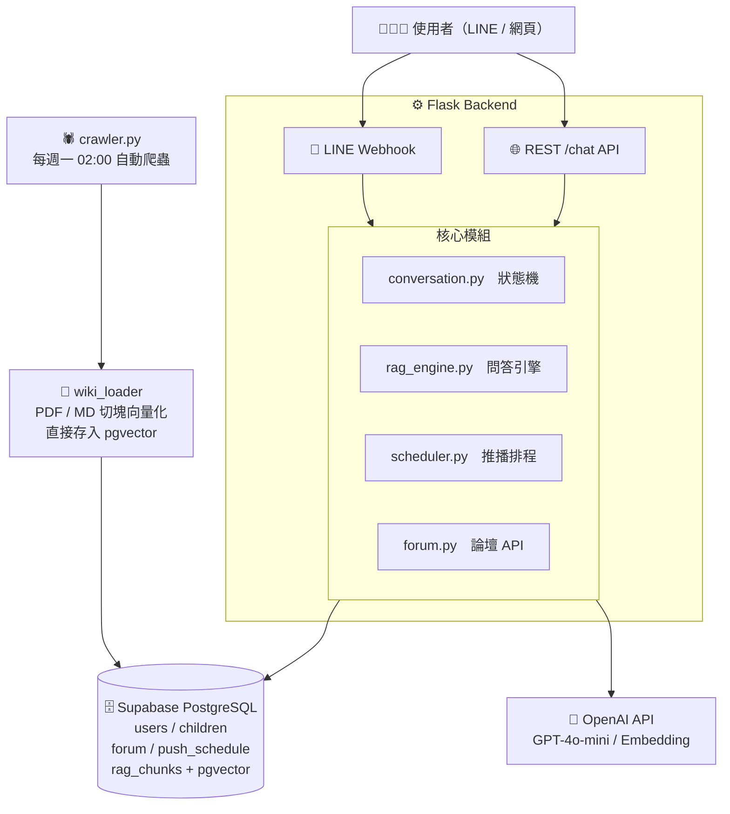

# 育兒導航全攻略

**基於 RAG 與時序提醒之新手爸媽智慧應援 Agent**

> 上架與部署流程請見 [DEPLOY.md](./DEPLOY.md)

---

## 專案介紹

台灣每年有超過 20 萬名新生兒，新手爸媽面對的育兒補助、疫苗接種、托育申請資訊散落在衛福部、教育部、勞動部、各縣市政府等數十個官方網站，光是要搞清楚「我的寶寶該打什麼疫苗、能領哪些補助、在哪裡申請」就已經令人頭痛。

**育兒導航全攻略**是一個整合 LINE Bot 與網頁的智慧育兒助理，解決三個核心問題：

- **查不到**：整合 26+ 份政府官方知識文件，一句話問出跨部會的育兒資訊，不需要自己跑多個官網
- **錯過了**：系統記住寶寶的生日，自動計算疫苗接種時程、補助申辦截止日，到期前主動推播 LINE 提醒
- **沒人問**：提供 Dcard 風格的社群論壇，讓爸媽互相分享申辦心得、交流育兒經驗

---

## 技術說明

### RAG 問答引擎

RAG（Retrieval-Augmented Generation，檢索增強生成）是本專案的核心技術。它解決了直接使用 ChatGPT 的兩個根本問題：一是 AI 會憑空捏造不存在的補助金額或截止日期，二是訓練資料有截止日、無法反映最新政策。

**運作流程如下：**

```
1. 知識庫建立
   政府網站 / PDF → 人工或爬蟲整理 → Markdown 文件
   → 切成 500 字的小段落（Chunk）
   → OpenAI text-embedding-3-small 轉成向量數字（1536 維）
   → 存入 Supabase PostgreSQL rag_chunks 表（pgvector 欄位）

2. 使用者提問時
   問題 → 同樣轉成向量
   → pgvector HNSW 索引用 <=> cosine 距離找出最相近的 3~5 段知識
   → 加入使用者的縣市、寶寶年齡（Context Enrichment）
   → 組合成完整 Prompt 交給 GPT-4o-mini 生成回覆
   → 附上來源 Wiki 標籤回傳給使用者
```

這樣做的好處是：每一句回答都有政府文件根據，系統不會憑空捏造。如果知識庫裡真的沒有答案，GPT 被明確指示回答「我不清楚，建議您致電 1925 衛福部諮詢專線，或前往 born.taipei 查詢」，不亂猜。

縣市過濾也在這一層做：搜尋時同時帶入使用者的戶籍縣市，確保台北市的使用者看到的是台北市的補助金額，不會混入新北市或桃園市的資料。

### 主動時序推播

對話狀態機（conversation.py）引導使用者完成 6 步驟建檔（縣市 → 暱稱 → 生日 → 性別），建檔完成後系統自動計算出寶寶一生中每個疫苗接種時間點、補助申辦截止日，全部寫入 Supabase PostgreSQL 的 `push_schedule` 表。

APScheduler 每天早上 09:00 掃描這張表，找出今天到期的事件，透過 LINE Push Message API 主動發送 Flex 卡片通知，不需要使用者自己記得。

### LLM Wiki 知識庫 vs 純向量資料庫 RAG

這兩種架構外表看起來很像，但設計理念不同：

**純向量資料庫 RAG（傳統做法）**

直接把文件丟進向量資料庫，沒有前處理。查詢時用語意相似度撈回片段，交給 LLM 生成回答。缺點是：文件品質參差不齊、政府公文裡的廢話全部被向量化，搜尋結果雜且不精準。最重要的是，**時序資訊（例如「滿 2 個月要打疫苗」）只是被動地嵌在文字裡，系統不知道這是一個「時間點」**，無法主動提醒。

**本專案的 LLM Wiki 做法**

我們在向量化之前多做了一層人工結構化：每一份知識文件都是 Markdown 檔案，頂部有 YAML Frontmatter 明確標記 `tags`、`適用縣市`、`時序規則`。好處有三：

1. **品質控管**：人工整理過的文件去除公文廢話，chunk 資訊密度更高，搜尋結果更精準
2. **縣市過濾**：每個 chunk 帶有 `cities` metadata，RAG 查詢時直接過濾，台北市用戶只看到台北市的資料，不會混到桃園的補助金額
3. **時序驅動的主動推播**：`時序規則` 欄位被 `wiki_loader.py` 解析成 Supabase `milestones` 表裡的結構化資料（`trigger_type: age_months`, `trigger_value: 2`），APScheduler 每天掃這張表，才能主動推播「寶寶下週滿 2 個月，記得打疫苗」——這是純向量 RAG 做不到的功能

簡單說：**LLM Wiki 讓知識從「可搜尋的文字」升級為「可驅動行為的結構化資料」**。

---

### 知識庫自動維護

知識庫不是一次性建立就結束。政府政策隨時更新，因此系統內建自動爬蟲（crawler.py），每週一凌晨 02:00 自動抓取衛福部、國健署、台北市 born.taipei 等 5 個政府網站。每次抓取後計算內容的 MD5 hash 值，只有當內容真正改變時，才更新 Markdown 文件並重新向量化，避免浪費 API 費用。

---

## 系統架構



---

## 技術架構

### 後端

| 模組 | 說明 |
|------|------|
| `app.py` | Flask 主程式，整合 LINE Webhook 與 REST API |
| `rag_engine.py` | pgvector `<=>` cosine 搜尋 + Context Enrichment + GPT-4o-mini 生成 |
| `conversation.py` | 6 步驟對話狀態機（IDLE → ASK_CITY → … → DONE），狀態存於 Supabase |
| `scheduler.py` | APScheduler：每日 09:00 推播里程碑，每週一 02:00 觸發爬蟲 |
| `wiki_loader.py` | 解析 `.md` 與 `.pdf`，切塊後呼叫 OpenAI Embedding，直接寫入 PostgreSQL `rag_chunks.embedding` |
| `crawler.py` | BeautifulSoup 爬取 5 個政府網站，MD5 hash 比對後自動更新知識庫 |
| `flex_templates.py` | LINE Flex Message 卡片模板（推播通知、RAG 回覆、歡迎卡） |
| `auth.py` | 網頁版帳號系統（bcrypt 雜湊、Flask Session） |
| `forum.py` | Dcard 風格社群論壇 API（5 大板塊、匿名發文、巢狀留言、按讚） |
| `db.py` | psycopg2 + ThreadedConnectionPool，封裝常用查詢與 batch_save_embeddings |
| `config.py` | 從 `.env` 讀取所有環境變數（DATABASE_URL / SUPABASE_URL） |

### 前端

| 檔案 | 說明 |
|------|------|
| `parenting-navigator-v6.html` | 單頁式網站，右下角浮動聊天 Widget，呼叫 `/chat` API |

### 資料庫（Supabase PostgreSQL）

| 表格 | 用途 |
|------|------|
| `users` | LINE 使用者資料（戶籍縣市） |
| `children` | 寶寶基本資料（暱稱、生日、性別） |
| `milestones` | 里程碑定義（疫苗 / 補助，含 trigger_type + trigger_value） |
| `push_schedule` | 待推播事件（疫苗、補助到期） |
| `wiki_articles` | Wiki 文件元資料（filename、tags、file_hash） |
| `rag_chunks` | 切塊 + embedding 向量（`vector(1536)`，pgvector HNSW 索引） |
| `crawl_log` | 爬蟲執行記錄 |
| `conversation_state` | 對話狀態機當前狀態（JSONB temp_data） |
| `web_users` | 網頁版帳號 |
| `forum_categories` | 論壇板塊（5 類） |
| `forum_posts` | 貼文 |
| `forum_comments` | 留言（支援巢狀） |
| `post_likes` / `comment_likes` | 按讚記錄 |

### 知識庫

- **Wiki 格式**：`.md` 含 YAML Frontmatter（`tags`、`適用縣市`、`時序規則`）
- **PDF 格式**：命名慣例 `縣市_標題.pdf`，自動解析縣市與標題
- **向量化流程**：文字 → 500 字切塊 → OpenAI `text-embedding-3-small`（1536 維）→ 直接存入 Supabase `rag_chunks.embedding`
- **搜尋策略**：SQL `WHERE meta_cities ILIKE '%縣市%' OR ILIKE '%全國%'`，搭配 HNSW `<=>` cosine 距離排序，Context Enrichment 個人化

---

## 使用介紹

### LINE Bot

1. 加入 LINE Bot 好友後，系統發送歡迎 Flex 卡片
2. 輸入「**設定寶寶**」→ 對話狀態機引導填入戶籍縣市、寶寶暱稱、生日、性別
3. 完成後系統自動計算疫苗與補助時程，寫入推播排程
4. 每日 09:00 若有里程碑到期，主動推播 LINE 通知
5. 任何育兒問題直接輸入文字 → RAG 問答引擎即時回覆（附來源標籤）

**特殊指令**

| 輸入 | 功能 |
|------|------|
| `設定寶寶` / `新增寶寶` | 啟動建檔流程 |
| `我的寶寶` / `查看資料` | 查看已建立的寶寶資料 |
| `今日提醒` | 查看今天的待辦推播 |

### 網頁版

1. 開啟 `parenting-navigator-v6.html`（或部署後的網址）
2. 右下角點擊聊天泡泡開啟浮動視窗
3. 選擇縣市（可選）後直接輸入問題
4. 回覆下方顯示來源 Wiki 標籤與延伸提問快捷鍵

### 論壇

1. 右上角「登入 / 註冊」建立帳號
2. 選擇板塊（補助討論 / 寶寶健康 / 托育分享 / 新手問答 / 生活日常）
3. 發文支援匿名選項；留言支援巢狀回覆
4. 可切換「最新」或「熱門」排序

---

## API 路由總表

| 方法 | 路由 | 說明 | 需登入 |
|------|------|------|--------|
| POST | `/webhook` | LINE Bot Webhook | — |
| GET | `/health` | 健康檢查 | — |
| POST | `/chat` | 網頁聊天 API | — |
| POST | `/auth/register` | 註冊 | — |
| POST | `/auth/login` | 登入 | — |
| POST | `/auth/logout` | 登出 | — |
| GET | `/auth/me` | 取得個人資料 | ✅ |
| PATCH | `/auth/me` | 更新個人資料 | ✅ |
| GET | `/forum/categories` | 板塊列表 | — |
| GET | `/forum/posts` | 貼文列表（?category=&sort=&page=） | — |
| POST | `/forum/posts` | 發文 | ✅ |
| GET | `/forum/posts/<id>` | 單篇貼文 + 留言 | — |
| DELETE | `/forum/posts/<id>` | 刪除貼文 | ✅ |
| POST | `/forum/posts/<id>/comments` | 留言 | ✅ |
| POST | `/forum/posts/<id>/like` | 按讚 / 取消 | ✅ |
| POST | `/forum/comments/<id>/like` | 留言按讚 | ✅ |
| GET | `/forum/hot` | 熱門貼文 Top 10 | — |

---

> 部署步驟（Docker MySQL、Render 上架、ngrok 本地測試）請見 **[DEPLOY.md](./DEPLOY.md)**
